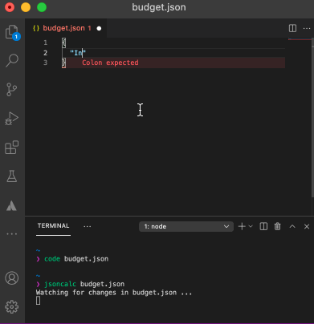

# jsoncalc

A utility to watch a json file and run calculations recursively.

## Installation

```bash
npm install --global jsoncalc
```



### Usage

```bash
jsoncalc budget.json
```

#### `jsoncalc -h`

```text
Usage: jsoncalc [options] <pathToJson>

Watches for changes and adds calculated elements to each hashmap in the json file at <pathToJson>

Options:
  -V, --version            output the version number
  -r, --reducer <reducer>  One or more (comma seperated) of the available reducer computations, e.g. [sum, count, avg, yep, nope]. (default: sum)
  -h, --help               display help for command
```
